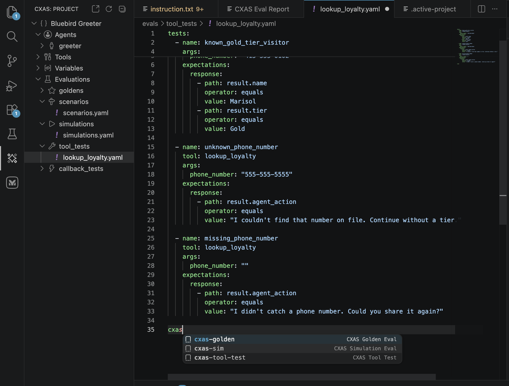

# Authoring features

Once you have a CXAS project open, the day-to-day editor experience is what saves you time. This page covers the language features (syntax highlighting, hover, Cmd+click, inline lint, snippets) and the tree-based scaffolding that creates the right files in the right places.

If you haven't built a project yet, the [Quickstart](quickstart.md) walks through every command on this page in context.

---

## The CXAS Project tree

The tree under the **CXAS** activity bar icon is grouped by resource type. Each group has an inline `+` action that scaffolds a new resource of that type, and a right-click context menu with additional actions (push, lint, link as sub-agent, and so on).

| Group | What's in it | What `+` creates |
|---|---|---|
| **App node** | The current app (named after `display_name` in `app.json`) | Right-click to push, lint, open in console, or open the live chat for this app. |
| **Agents** | Every agent under `cxas_app/<App>/agents/` | A new agent directory with `<name>.json` and an empty `instruction.txt`. |
| **Tools** | Every tool under `cxas_app/<App>/tools/` | A new tool directory with `<name>.json` and `python_function/python_code.py`. |
| **Callbacks** | The agent's callbacks, grouped by hook type | A new callback file under the right hook type, with the correct typed signature. |
| **Variables** | Variables declared in `app.json` | A new entry in `app.json`'s `variableDeclarations`. |
| **Evals** | Eval YAMLs under `evals/` at the workspace root, grouped by type | (No `+`; create eval YAMLs by hand and the tree picks them up on refresh.) |

The tree updates automatically when files change on disk. If it gets out of sync (rare), use the refresh icon on the panel header.

---

## `instruction.txt` editor features

`instruction.txt` is registered as the `cxas-instruction` language. The plugin layers three things on top of it: syntax highlighting, hover hints, and Cmd+click navigation.

### Syntax highlighting

The grammar colorizes the four placeholder shapes that appear in instruction text:

- `{@TOOL: name}` is colorized as a tool reference
- `{@AGENT: name}` is colorized as a sub-agent transfer
- `{variable}` is colorized as a session variable
- The `<role>`, `<persona>`, `<taskflow>`, `<subtask>`, `<step>`, `<trigger>`, `<action>`, `<examples>` XML tags get the standard XML highlighting

The colorization works regardless of whether the referenced tool, agent, or variable actually exists yet. References to missing things are caught by the lint rules, not the grammar.

### Hover hints

Hover over a tool or variable reference and the editor pops a tooltip with the resolved description:

For a tool, the popup shows the function's docstring and signature. For a variable, it shows the type and default from `app.json`. For a sub-agent reference, it shows the agent's `description`.

### Cmd+click navigation

**Cmd+click** (or **F12** / **Go to Definition**) on a reference jumps to its source:

| Reference | Jumps to |
|---|---|
| `{@TOOL: lookup_loyalty}` | `tools/lookup_loyalty/python_function/python_code.py` |
| `{@AGENT: support}` | `agents/support/instruction.txt` |
| `{cafe_name}` | The variable's entry in `app.json` |
| `"childAgents": ["support"]` (in agent JSON) | `agents/support/<agent>.json` |

This works in both `instruction.txt` and `agents/<name>/<name>.json`.

### Inline lint

The same rules that `cxas lint` enforces run in the background as you type. Errors and warnings show as squiggles in the editor and entries in the Problems panel:

![instruction.txt with the line 'Call {@TOOL: notarealtool} for fun.' highlighted with a red squiggle under 'notarealtool', and an inline tooltip reading '[I013] {@TOOL: notarealtool} referenced but not in agent's tools list cxas(I013)' with a Quick Fix offered to 'Add notarealtool to the tools array in the agent JSON'](../assets/vscode/inline-lint-squiggly.png)

Most rules surface a **Quick Fix** action (light bulb in the gutter, or `Cmd+.`). For example, rule **`I013`** (a `{@TOOL: ...}` reference not in the agent's `tools` array) offers to insert the missing tool name automatically.

To rerun the full project lint on demand, focus a project file and press **`Cmd+Shift+L`** (or run **`CXAS: Lint App`**). Results land in the **CXAS** output channel; for a clean run you should see `0 error(s)`.

!!! tip "Disable lint-on-save"
    Heavy linting on every save can be noisy mid-edit. Set `cxas.lintOnSave` to `false` (see [Settings](settings.md)) and rely on the inline checks plus on-demand `Cmd+Shift+L`.

---

## Scaffolding new resources from the tree

Every resource type has an inline `+` button next to its group header **and** a right-click context menu. They run the same underlying command; pick whichever feels faster.

### New agent

Click **`+`** on the **Agents** row, or right-click the row and pick **New Agent**. The prompt asks for an agent display name (free text):

The extension creates `agents/<name>/<name>.json` and an empty `instruction.txt`, then opens the instruction file. To make this agent the **root agent** for the app, edit `app.json` and set `"rootAgent": "<name>"`.

To create a **sub-agent**, right-click an existing agent (not the `Agents` group) and pick **New Sub-agent**. The new agent is automatically added to the parent agent's `childAgents` array.

### New tool

Click **`+`** on the **Tools** row. The prompt asks for a tool name in `snake_case`:

The extension creates `tools/<name>/<name>.json` and `tools/<name>/python_function/python_code.py` with a function stub matching the name you entered, then opens the Python file. Edit the docstring (it's surfaced in hover hints) and the implementation:

After saving, the tool sync provider notices any agent instruction that references the new tool (via `{@TOOL: ...}`) and offers to add it to the agent's `tools` array. Accept the suggestion or run **`CXAS: Sync Callbacks`** to bulk-fix all agents.

### New callback

Right-click an **agent** (not the `Agents` group) and pick **New Callback**:

A QuickPick opens with the six callback hook types:

Pick a hook type, then enter a name. The extension creates `agents/<agent>/<hook>/<name>/python_code.py` with a typed stub for that specific hook (different signature for each type) and a lint header that silences the warnings about runtime-injected names like `CallbackContext`:

![inject_today/python_code.py open in the editor showing the lint header (pyright/pylint/ruff suppressions), an import of date, and the before_agent_callback function body that sets state['today'] when missing](../assets/vscode/callback-python-code.png)

The stub also includes a docstring describing when that hook fires, so you don't have to look it up.

### New variable

Click **`+`** on the **Variables** row. The prompt asks for a variable name. The extension adds an entry to `app.json`'s `variableDeclarations` with a `STRING` schema and an empty default; edit the JSON to change the type or default.

### Linking and unlinking sub-agents

Right-clicking an agent also exposes:

- **Link as Sub-agent of...** — adds this agent to another agent's `childAgents`
- **Add Existing Sub-agent...** — picks one of the unlinked agents and adds it under this one
- **Unlink from Parent...** — removes this agent from its parent's `childAgents`

These edit the agent JSONs directly and refresh the tree.

---

## Eval snippets

Eval YAMLs ship with snippet completion in the YAML language. In any `.yaml` file under `evals/`, type the snippet prefix and press `Tab` (or trigger completion explicitly with `Ctrl+Space`):

| Prefix | Inserts |
|---|---|
| `cxas-tool-test` | A `tool_tests:` block with one happy-path test case |
| `cxas-golden` | A `conversations:` block with two turns and an `expectations:` block |
| `cxas-sim` | A `scenarios:` block with `task`, `max_turns`, and `expect_criteria` |
| `cxas-config` | A complete `gecx-config.json` template |

The snippets use `Tab` stops, so you can fill in field by field without taking your hands off the keyboard.

---

## Status bar

Two indicators sit in the bottom-left status bar when a CXAS project is open:

- The **active project** name (clickable: opens **`Set Active Project`** to switch between sibling CXAS projects in the same workspace)
- The **app display name** (clickable: opens **`Inspect App Architecture`** for that app)

For workspaces with a single CXAS project, the active-project indicator is informational; it becomes useful only when you have several CXAS projects nested under one workspace folder.

---

## Where to go next

[Evaluations](evaluations.md)
:   The full eval lifecycle once your YAMLs are in place: pushing platform goldens, running individual tests, the aggregated report panel.

[Settings &amp; troubleshooting](settings.md)
:   Toggles for lint-on-save, custom Python path, and other knobs that change authoring behavior.
