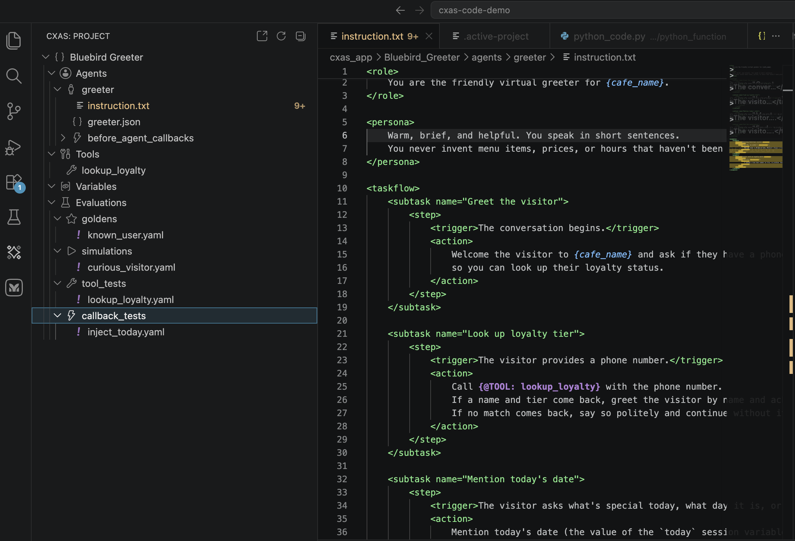
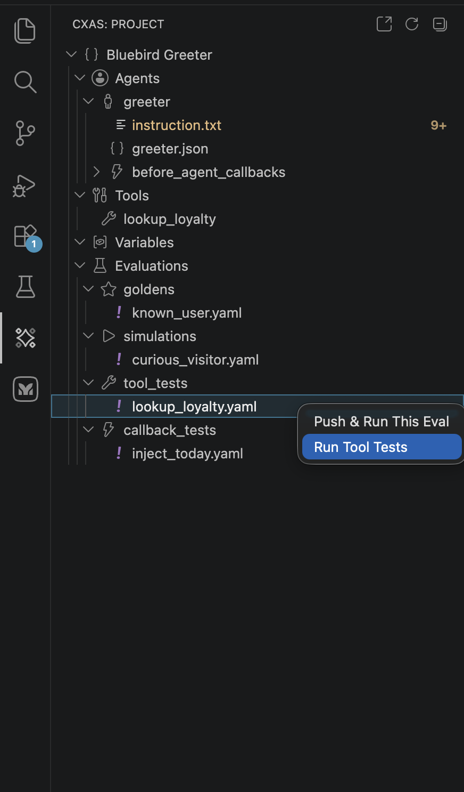
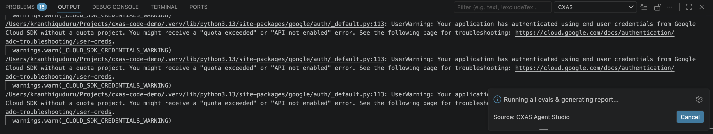
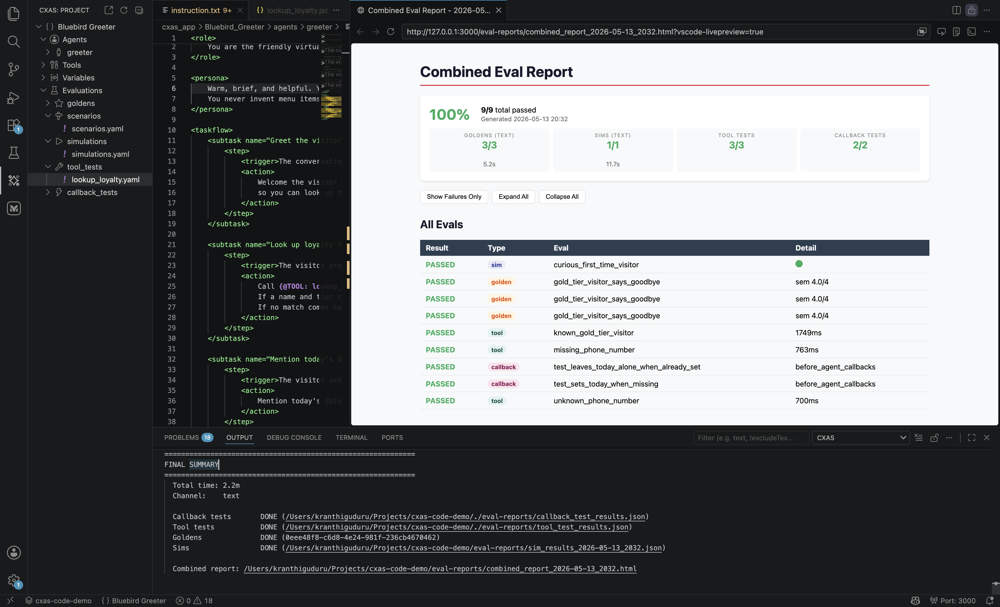

# Evaluations

The extension wraps the four CXAS eval surfaces (tool tests, callback tests, platform goldens, and local simulations) into a tree-driven workflow. You can run a single eval inline from a context menu, push platform goldens into CES, or kick off the whole suite and view an aggregated report panel.

This page assumes you already have eval YAMLs in place. The [Quickstart](quickstart.md) walks through creating the four canonical eval files for the bluebird-greeter demo.

---

## Where evals live

Eval YAMLs live in `evals/` at the **workspace root**, grouped into one subdirectory per type. The plugin's tree picks them up automatically:

| Subfolder | What goes there | Run by |
|---|---|---|
| `evals/tool_tests/` | YAMLs with a `tool_tests:` block; one or more cases per tool | `cxas test-tools` |
| `evals/callback_tests/` | YAMLs with a `callback_tests:` block; one or more cases per callback | `cxas test-callbacks` |
| `evals/goldens/` | Platform goldens — turn-by-turn ideal conversations pushed to CES, then run there | `cxas push-eval` then `cxas run` |
| `evals/scenarios/` | Platform scenarios — open-ended task descriptions evaluated by an LLM judge on the deployed app | `cxas push-eval` then `cxas run` |
| `evals/simulations/` | Local simulations — sim-user driven scenarios run by `scrapi-sim-runner.py` | (Local; no platform push needed) |

Once the files exist, expand the **Evaluations** group in the CXAS tree:

If a subfolder doesn't appear, check that:

- The folder is at the workspace root, **not** inside `cxas_app/`
- The YAML has the right top-level key (`tool_tests:`, `callback_tests:`, `conversations:`, or `scenarios:`)
- The plugin's tree has been refreshed (use the refresh button on the panel header)

---

## Running a single eval

Right-click any eval YAML in the tree to see the available actions:

The menu adapts to the eval type. The same right-click on a different file would show:

| Eval file under | Available actions |
|---|---|
| `evals/tool_tests/<name>.yaml` | **Run Tool Tests** — runs the tests locally against the app's tool definitions |
| `evals/callback_tests/<name>.yaml` | **Run Callback Tests** — runs the callbacks against the test cases |
| `evals/goldens/<name>.yaml` | **Push & Run This Eval** (push the golden to CES then run it) and **Push Eval** |
| `evals/scenarios/<name>.yaml` | **Push & Run This Eval** and **Push Eval** |
| `evals/simulations/<name>.yaml` | **Push & Run This Eval** (runs the simulation locally; no platform push) |

For tool and callback tests, the run is local and finishes in a few seconds. For goldens and scenarios, the extension first calls `cxas push-eval` to upload the YAML to CES, then `cxas run` to execute it on the deployed app. Plan for ~30s per platform eval.

The same actions are also available from the **editor context menu** — right-click inside an open eval YAML to get **Push & Run This Eval** without needing to find the file in the tree.

---

## Running the full suite

Right-click the **Evaluations** group itself and pick **Run All Evals & Report**. The extension runs every eval in every subfolder, then opens a webview with the aggregated report:

When the run finishes, a webview opens with a combined report:

The report has three views:

- **Summary tiles** at the top show pass/fail counts per category
- **All Evals** is a flat table listing every individual case (one row per turn, tool case, or callback case) with timing and a `Detail` link that opens the underlying log
- **Show Failures Only / Expand All / Collapse All** toggles let you drill in on regressions

The bottom panel of the editor (the **CXAS** output channel) keeps the streaming log and a `FINAL SUMMARY` block with paths to the on-disk reports. You can re-open the same report later with **`CXAS: View Eval Report`**.

---

## The push-and-run pattern for goldens

Platform goldens and scenarios are evaluated by CES, not by your local machine. The lifecycle has two steps:

1. **Push** the YAML to CES (`cxas push-eval`) so the platform knows about the conversation
2. **Run** the eval on the deployed app (`cxas run --wait`) and read back results

The extension's **Push & Run This Eval** action does both in one shot. **Push Eval** does just the first half — useful when you want the eval to live on the platform (so the console UI can run it) but don't want to execute it right now.

!!! warning "Pushing requires a deployed app"
    `Push & Run This Eval` will fail if `gecx-config.json` doesn't have a valid `deployed_app_id`. If you skipped `Create App`, the extension has no platform target. Either run `CXAS: Create App` first, or import an existing app via [Importing from CES](importing.md).

---

## Tips and considerations

**Use snippet completion for new eval cases**
: In any eval YAML, type `cxas-tool-test`, `cxas-golden`, or `cxas-sim` to insert a fresh case skeleton with `Tab` stops. See [Authoring features](authoring.md#eval-snippets) for the full list.

**Keep tool and callback tests local-only**
: Tool tests don't need a deployed app — they run against the local Python implementations. This makes them the fastest feedback loop while iterating on a tool. Run them on every save while writing the implementation; push platform goldens only when you're ready to verify on the real model.

**Tag your evals**
: Goldens and scenarios both support a `tags:` field. The runner filters on tags, which makes it cheap to keep a `[smoke]` subset for fast pre-push checks and a fuller `[regression]` suite for nightly runs.

**The combined report is on disk**
: The webview is just a renderer over a JSON file. The `FINAL SUMMARY` block in the output channel prints the path. You can commit the report to a `reports/` directory if you want a tracked history, or wire the same JSON into a CI dashboard.

---

## Where to go next

[Importing from CES](importing.md)
:   The other way to start a workspace, with eval skeletons bootstrapped automatically.

[Settings &amp; troubleshooting](settings.md)
:   Knobs for changing where the runner finds helper scripts, the `cxas` binary, and authentication.
