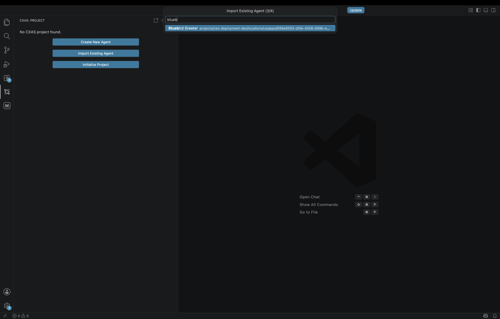

# Importing from CES

The **Import Existing Agent** flow is the fastest way to start working on an app that already lives on the platform. The extension walks you through four prompts (project, location, app, folder), pulls the app's full configuration, scaffolds eval directories, and opens the root agent's `instruction.txt` so you can start editing immediately.

This is the right entry point when:

- A teammate created the app via the CES console and you need to take over editing it
- You're triaging a production app and want a local copy to lint, run evals against, or branch
- You're forking an existing app for an experiment and don't want to rebuild it from scratch

If you're starting from nothing, see [Quickstart](quickstart.md) instead.

---

## Before you start

Make sure:

- You have an empty workspace folder open in VS Code (`File → Open Folder...`). The import writes into the current workspace; opening it inside an existing CXAS project will work but adds a sibling project alongside the existing one.
- You're authenticated with `gcloud auth application-default login` and your default project has CES enabled.
- You know either the app's **display name** or its full **resource name** (`projects/<project>/locations/<location>/apps/<id>`). The wizard can list apps for you, so a project ID alone is enough.

---

## The four-step wizard

Run **`CXAS: Import Existing Agent`** from the Command Palette (`Cmd+Shift+P`).

### Step 1 — GCP project ID

The first prompt's title bar reads **`Import Existing Agent (1/4)`** and asks for the GCP project that owns the app. Type the project ID (e.g. `ces-deployment-dev`) and press **Enter**.

### Step 2 — Location

Pick either `us` or `eu` from the QuickPick. This is the CES region for the app, not the GCP region for compute.

### Step 3 — Pick the app

The third prompt asks how to choose the app: **`List apps from project`** (recommended) or **`Enter app ID manually`**.

The list option calls `cxas apps list` against your project and shows the result as a searchable QuickPick. Type any part of the display name to filter:



Pick the app and press **Enter**. (If you have a known resource name and want to skip the listing, choose **`Enter app ID manually`** in the previous step and paste the full `projects/.../apps/...` string.)

### Step 4 — Local folder name

The last prompt asks for the local folder name. The default is derived from the app's display name (`bluebird-greeter` for `Bluebird Greeter`), kebab-cased. Accept it or type your own and press **Enter**.

---

## What the import does

The wizard runs four steps with a progress notification:

1. **Creates the project scaffold** at `<folder>/` with a populated `gecx-config.json` (project, location, app name, app dir, modality detected from the app's model)
2. **Pulls the app from CES** into `<folder>/cxas_app/<App>/` using `cxas pull`
3. **Bootstraps evaluations** by exporting any platform-side evaluations into `<folder>/evals/` and creating empty `goldens/`, `scenarios/`, `simulations/`, `tool_tests/`, and `callback_tests/` subfolders
4. **Opens the root agent's `instruction.txt`** so you land directly in the file you'll most likely edit first

After it completes, click the **CXAS** activity bar icon. The Project tree shows the imported app populated with its agents, tools, and (if present) evaluations:


The bottom output channel shows what was bootstrapped:

```
Generated test template: .../evals/tool_tests/lookup_loyalty.yaml

Bootstrap complete:
  goldens: OK (1)
  scenarios: OK (0)
  tool_tests: OK
  callback_tests: OK
  sim_skeleton: OK

Updated gecx-config.json with model: ..., modality: text
Import complete! Project: bluebird-greeter/
```

The exported eval YAMLs are starting points; refine them as you'd refine any other test. The empty subfolders are placeholders for the eval types the platform doesn't have yet (e.g. local simulations always start empty since they're authored locally).

---

## After the import

From here, the workflow is identical to a from-scratch project:

- Edit `instruction.txt`, tools, and callbacks in the editor
- Use **`CXAS: Lint App`** (or `Cmd+Shift+L`) before pushing
- **`CXAS: Push App`** sends your changes back to the same CES app you imported from
- **`CXAS: Open Live Chat`** talks to the deployed app
- **`CXAS: Run All Evals & Report`** runs the full suite

If you want to push into a *different* app (for example, to test changes on a staging branch without overwriting the original), use **`CXAS: Branch App`** first, then push. See the [Branching Apps](../guides/agent-development/branching.md) and [Team Collaboration](../guides/agent-development/team-collaboration.md) guides for the canonical multi-stage promotion pattern.

---

## Common issues

**"No apps found in this project."**
: Either the project has no CES apps, or your credentials don't have permission to list them. Check with `gcloud auth list` and `cxas apps list --project-id <project> --location <location>` from a terminal to confirm.

**The wizard fails at "Pulling agent from platform..."**
: Re-authenticate with `gcloud auth application-default login` and try again. If the pull keeps failing, run `cxas pull <resource-name> --target-dir /tmp/test --project-id ... --location ...` from a terminal to surface the underlying error.

**The tree shows the imported app but no `Evals` group**
: The bootstrap step ran but found nothing on the platform and created empty subfolders. The tree only displays subfolders that contain at least one YAML; create any eval file (or paste one of the [Quickstart](quickstart.md#step-11-add-evals-and-run-them) templates) and refresh the tree.

---

## Where to go next

[Quickstart](quickstart.md)
:   The from-scratch flow, useful as a reference for what each tree action does.

[Authoring features](authoring.md)
:   Editor and tree features for the day-to-day work after the import.

[Evaluations](evaluations.md)
:   How to run the bootstrapped evals (and add new ones) once the app is in your workspace.
