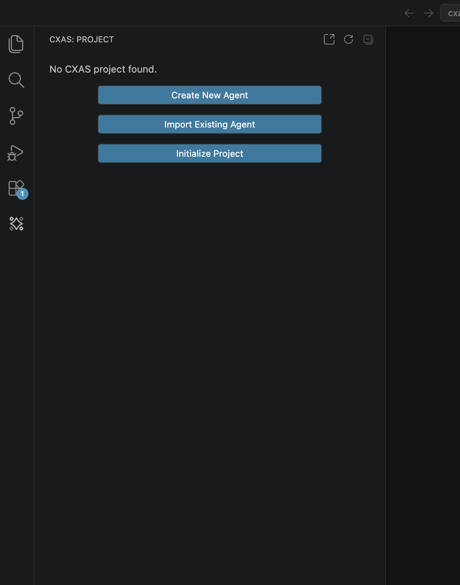

# CXAS Agent Studio for VS Code

The **CXAS Agent Studio** extension wraps the `cxas` CLI in a native VS Code experience. Everything you'd otherwise do from a terminal (pull, push, lint, run evals, chat with a deployed app) is a Command Palette entry or a tree-view click. Authoring is faster too: instruction files get syntax highlighting, hover hints, Cmd+click navigation between `{@TOOL: ...}` references, and inline lint as you type.

This section walks through installing the extension, building a complete demo agent end to end, and the day-to-day editor features you'll use after that.

---

## What you get

`Project tree`
:   A dedicated **CXAS** sidebar in the activity bar that lists every app, agent, tool, callback, variable, and eval in your workspace. Right-click context menus scaffold new resources without leaving the tree.

`Command Palette integration`
:   Every `cxas` command is mirrored under the `CXAS:` prefix in the palette: `Push App`, `Pull App`, `Lint App`, `Run Evaluation`, `Open Live Chat`, `Branch App`, and more.

`Inline lint`
:   The same rules as `cxas lint` run as you type, surfaced as squiggles in the editor and entries in the Problems panel. A keybinding (`Cmd+Shift+L` / `Ctrl+Shift+L`) reruns the full project lint on demand.

`Cmd+click navigation`
:   Click a `{@TOOL: name}` reference in `instruction.txt` to jump to the tool's `python_code.py`. The same works for `{variable}` references and sub-agent links inside agent JSON.

`Live chat`
:   A built-in webview that talks to your deployed CES app. Useful for sanity-checking a push without switching to the GCP console.

`Eval runner`
:   Run a single tool test, callback test, or golden inline; or run the full suite and view an aggregated report panel.

`Wizards`
:   Two onboarding flows: scaffold a project from scratch, or import an existing app from CES into a fresh local workspace.

---

## Empty project welcome

Open a workspace that doesn't have a CXAS project yet and the **CXAS** sidebar greets you with three buttons:

The rest of this section is organized around those three entry points:

- **Initialize Project** is covered by [Quickstart](quickstart.md), which walks you through building a complete demo agent (`bluebird-greeter`) from an empty folder.
- **Import Existing Agent** is covered by [Importing from CES](importing.md), the canonical way to start working on an app that already lives on the platform.
- **Create New Agent** opens an AI-assisted wizard that delegates scaffolding to a separate skill. It isn't covered here; the manual flow in Quickstart maps cleanly to the same outcome.

---

## Where to go next

[Installation](installation.md)
:   Install the `.vsix`, get the `cxas` CLI on your `PATH`, and skim the prerequisites.

[Quickstart](quickstart.md)
:   Build the `bluebird-greeter` demo end to end: app, agent, tool, callback, lint, push, live chat, evals.

[Authoring features](authoring.md)
:   The editor and tree features you'll use every day after the demo: syntax highlighting, hover, Cmd+click navigation, scaffolding context menus, and snippets.

[Evaluations](evaluations.md)
:   Tool tests, callback tests, goldens, and simulations: where they live, how the plugin runs them, and how to read the report panel.

[Importing from CES](importing.md)
:   The four-step `Import Existing Agent` flow for pulling a deployed app into a fresh workspace.

[Settings &amp; troubleshooting](settings.md)
:   Reference for every `cxas.*` setting plus fixes for the issues you're most likely to hit.
