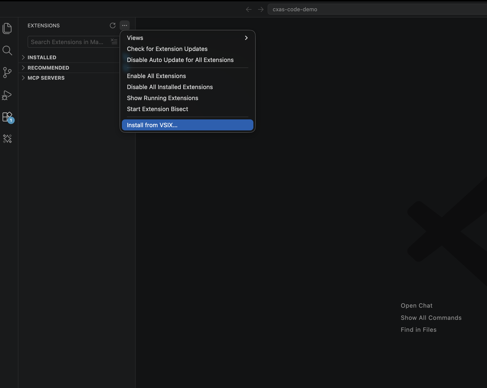
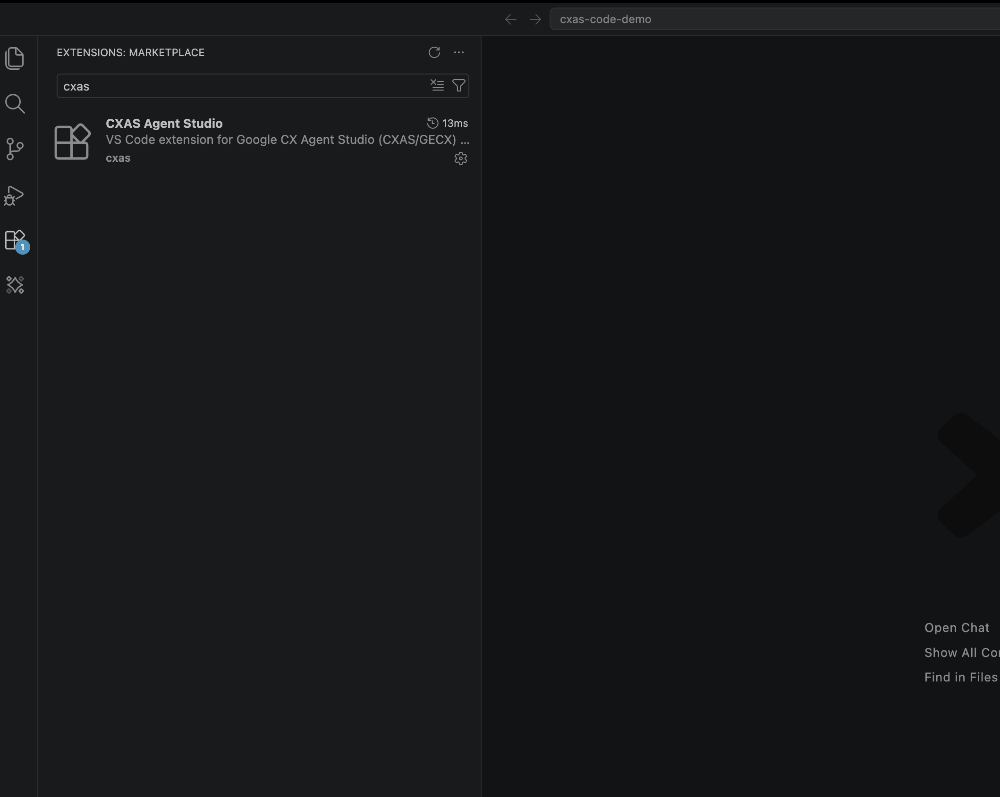
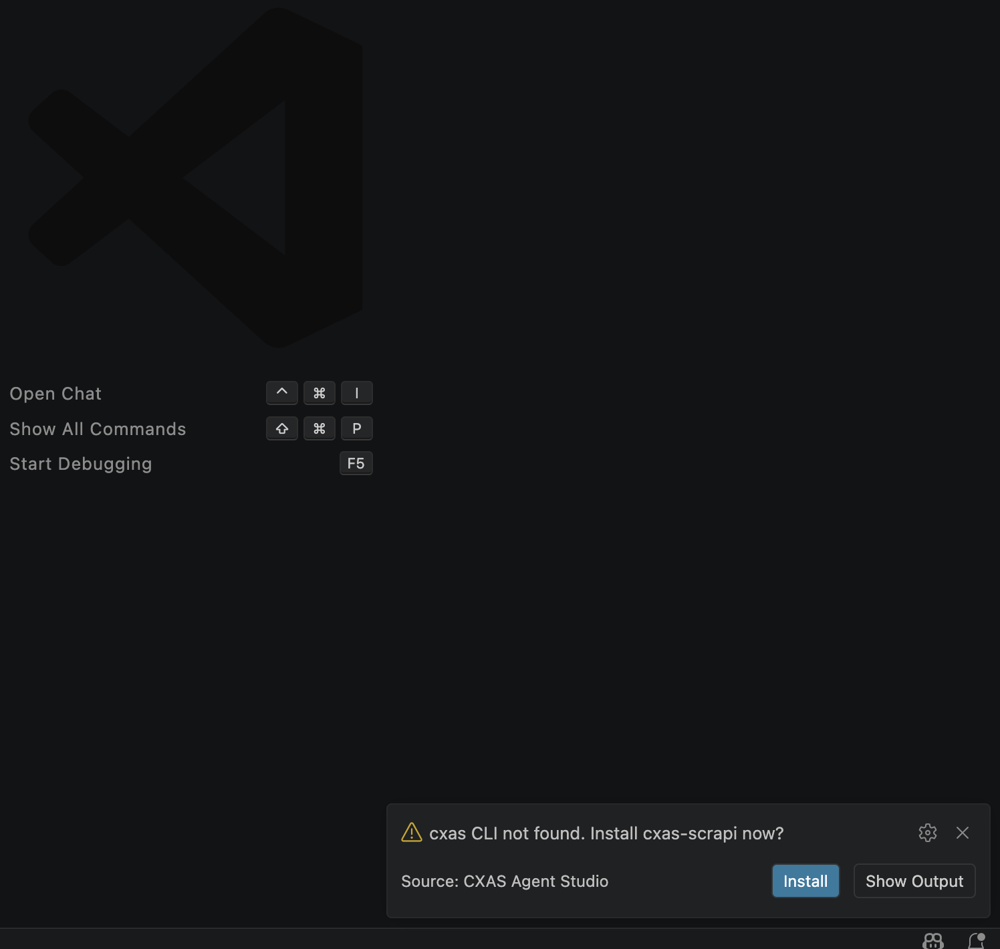
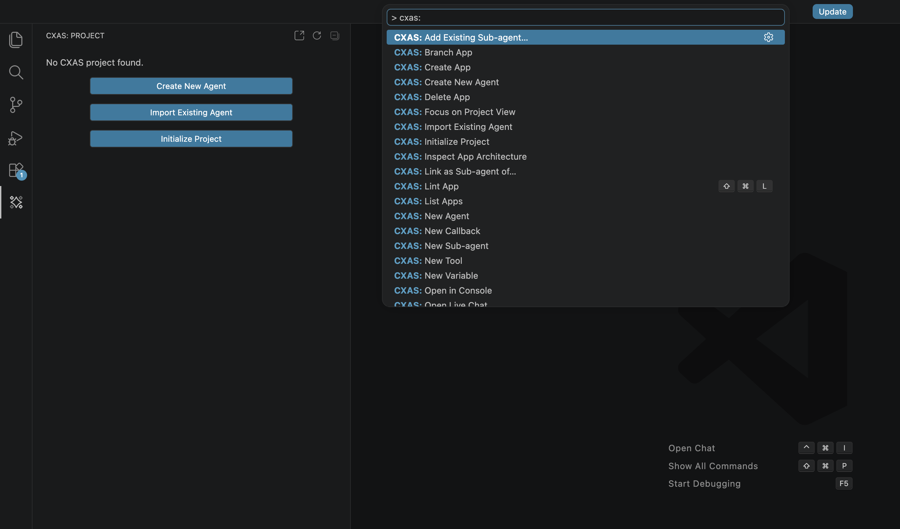

# Installation

The extension ships as a `.vsix` file. The first time you activate it, it offers to install the `cxas-scrapi` Python CLI for you. Once both pieces are in place you're ready to open a project.

---

## Prerequisites

| What | Why | How to check |
|---|---|---|
| **VS Code 1.85+** | Engine version the extension targets | `Code → About` |
| **Python 3.10 or newer** | The extension shells out to the `cxas` CLI | `python3 --version` |
| **`pip` on `PATH`** | Used by the auto-install prompt | `python3 -m pip --version` |
| **gcloud Application Default Credentials** | Required for `Push App`, `Pull App`, `Run Evaluation`, `Open Live Chat`, anything that talks to CES | `gcloud auth application-default login` |

If you already have `cxas-scrapi` installed and on your `PATH` (`cxas --help` works in your terminal), you can skip the auto-install prompt.

---

## Install the extension

Open the **Extensions** sidebar (`Cmd+Shift+X` / `Ctrl+Shift+X`), click the `…` menu in the top right of the panel, and pick **Install from VSIX...**:



Select the `cxas-agent-studio.vsix` file you were sent. When prompted, click **Reload Window** to activate.

After the reload, search for `cxas` in the Extensions panel to confirm the install:



---

## Install the `cxas` CLI

The extension needs the `cxas` Python CLI to do anything that touches CES. **You don't have to install it manually.** On first activation, if `cxas` isn't on your `PATH`, a notification pops up:



Click **Install**. The extension opens an integrated terminal labeled *CXAS Install* and runs:

```sh
python3 -m pip install -r <bundled requirements.txt>
```

When `pip` finishes, click **Reload Window** in the follow-up notification. That's it.

### Manual install (if you dismissed the prompt)

```sh
pip install cxas-scrapi
```

Then run **Developer: Reload Window** from the Command Palette so the extension picks up the new binary.

!!! tip "Behind a corporate proxy?"
    If `pip install` fails because of a private package index, configure pip first (or set `cxas.pythonPath` to a Python that already has `cxas-scrapi` installed) and re-run the install command. See [Settings &amp; troubleshooting](settings.md) for the relevant settings.

---

## Verify the install

Open the **Command Palette** (`Cmd+Shift+P`) and type `CXAS:`. You should see the full list of commands:



Twenty-plus commands are registered, all under the `CXAS:` prefix. The most common ones are covered in [Quickstart](quickstart.md); the rest are reachable from tree-view context menus and editor right-click menus.

---

## Where to next

The fastest way to confirm everything works is to build a small agent end to end. Continue to [Quickstart](quickstart.md), or jump straight to [Importing from CES](importing.md) if you already have a deployed app to pull from.
