# Quickstart

This walkthrough builds a complete CXAS agent (`bluebird-greeter`) from an empty folder using only the extension. By the end you'll have an app on CES, an agent with one tool and one callback, working evals, and a live chat session against the deployed app. Every step uses tree-view actions or Command Palette entries; there's no terminal involved.

The demo agent welcomes visitors to a fictional café, looks up their loyalty tier from a phone number, and ends the conversation cleanly. It's intentionally small so the editor and tree features are visible at every stage.

---

## Prerequisites

Before you start, make sure:

- The extension is installed (see [Installation](installation.md))
- The `cxas` CLI is on your `PATH` (`cxas --help` works in a terminal)
- You're authenticated against a GCP project that has CES enabled (`gcloud auth application-default login`)

You'll also want **paste-ready content** for the demo. Either keep this page open and copy from the code blocks below, or grab the bundled files from the repo at `examples/bluebird-greeter/` if you have them locally.

---

## Step 1: Open an empty workspace

Create an empty folder and open it as a workspace:

```bash
mkdir ~/Projects/bluebird-greeter
code ~/Projects/bluebird-greeter
```

Click the **CXAS** icon in the activity bar. You'll see the empty-project welcome screen with three buttons (`Create New Agent`, `Import Existing Agent`, `Initialize Project`).

---

## Step 2: Initialize the project

Run **`CXAS: Initialize Project`** from the Command Palette (`Cmd+Shift+P`). The extension prompts for a target directory:

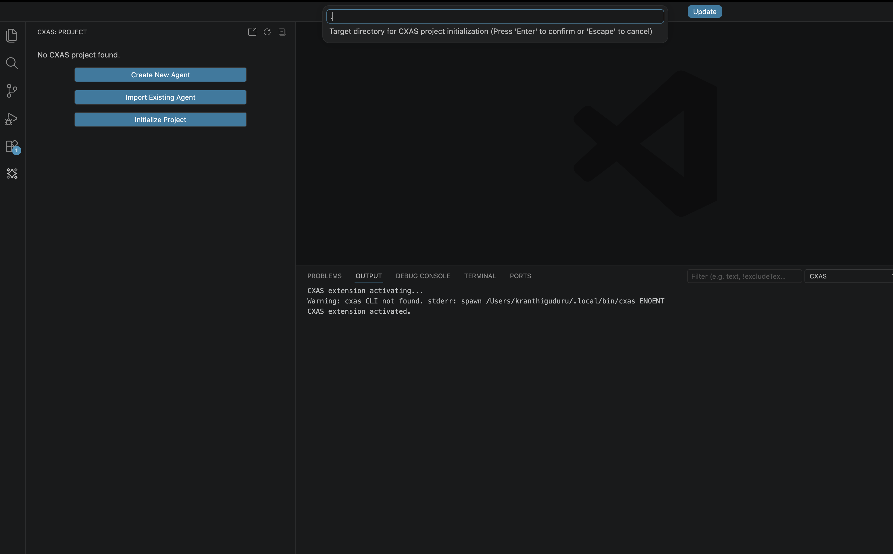

Press **Enter** to accept the default (`.`), which initializes in your current workspace. The CXAS output channel logs each file the init step writes:

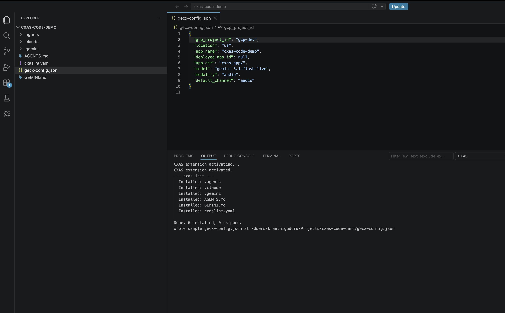

Open `gecx-config.json` and fill in the values for your project:

```json
{
  "gcp_project_id": "ces-deployment-dev",
  "location": "us",
  "app_name": "bluebird_greeter",
  "deployed_app_id": null,
  "app_dir": "cxas_app/",
  "model": "gemini-3-flash",
  "modality": "text",
  "default_channel": "text"
}
```

Save the file. The extension picks the changes up automatically.

---

## Step 3: Create the app on CES

Run **`CXAS: Create App`**. The first prompt asks for a display name:

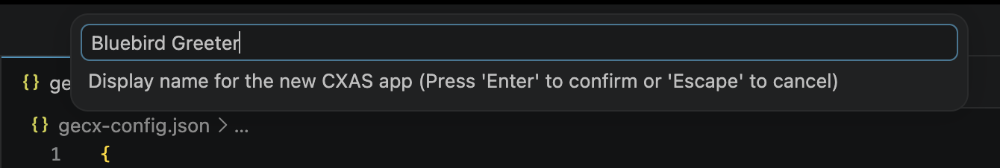

Type `Bluebird Greeter` and press **Enter**. The extension calls `cxas create` against your project, then auto-pulls the empty app into `cxas_app/Bluebird_Greeter/` and updates `gecx-config.json` with the new `deployed_app_id`.

Click the **CXAS** activity bar icon. The Project tree now shows the app with empty `Agents`, `Tools`, and `Variables` groups, and the status bar at the bottom names the active project:

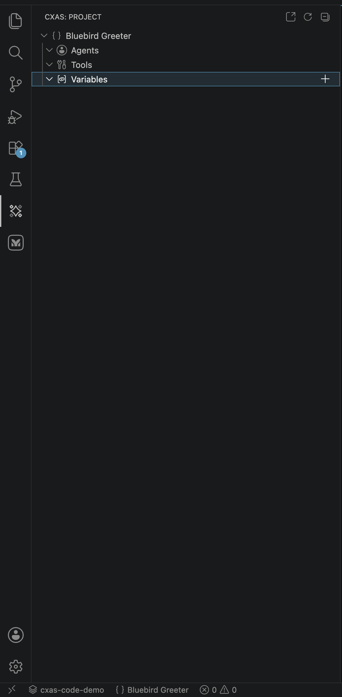

---

## Step 4: Add the `greeter` agent

Click the `+` button on the **Agents** row (or right-click the row and pick `New Agent`). A prompt appears for the agent's display name:

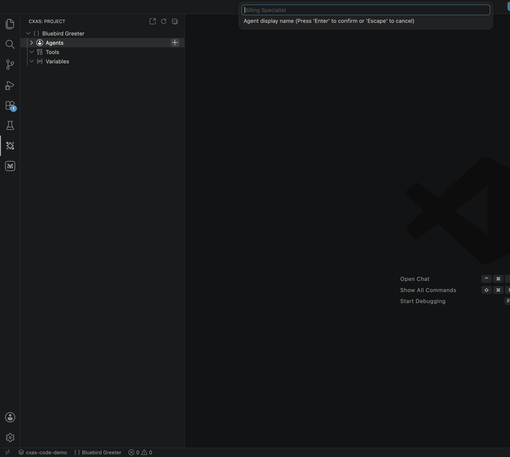

Type `greeter` and press **Enter**. The extension scaffolds `cxas_app/Bluebird_Greeter/agents/greeter/` with `greeter.json` and an empty `instruction.txt`, then opens `instruction.txt` in the editor.

Paste this instruction over the empty file:

```xml
<role>
    You are the friendly virtual greeter for {cafe_name}.
</role>

<persona>
    Warm, brief, and helpful. You speak in short sentences.
    You never invent menu items, prices, or hours that haven't been provided.
</persona>

<taskflow>
    <subtask name="Greet the visitor">
        <step>
            <trigger>The conversation begins.</trigger>
            <action>
                Welcome the visitor to {cafe_name} and ask if they have a phone number on file
                so you can look up their loyalty status.
            </action>
        </step>
    </subtask>

    <subtask name="Look up loyalty tier">
        <step>
            <trigger>The visitor provides a phone number.</trigger>
            <action>
                Call {@TOOL: lookup_loyalty} with the phone number.
                If a name and tier come back, greet the visitor by name and acknowledge their tier.
                If no match comes back, say so politely and continue without it.
            </action>
        </step>
    </subtask>

    <subtask name="Mention today's date">
        <step>
            <trigger>The visitor asks what's special today, what day it is, or anything date-related.</trigger>
            <action>
                Mention today's date (the value of the `today` session variable) and offer to help further.
            </action>
        </step>
    </subtask>

    <subtask name="End the conversation">
        <step>
            <trigger>The visitor says goodbye or indicates they're done.</trigger>
            <action>
                Thank them, wish them a great day, and call {@TOOL: end_session}.
            </action>
        </step>
    </subtask>
</taskflow>
```

Save. Notice the syntax highlighting: `{@TOOL: lookup_loyalty}` and `{cafe_name}` are colorized so they jump out from the surrounding XML.

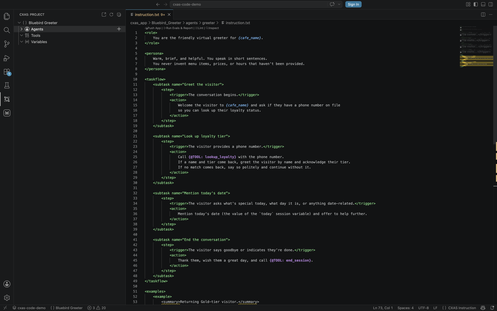

---

## Step 5: Add the `lookup_loyalty` tool

Click the `+` on the **Tools** row. The prompt asks for a tool name in `snake_case`:

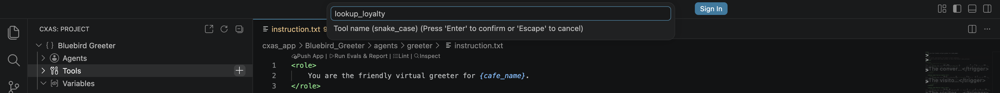

Type `lookup_loyalty` and press **Enter**. The extension scaffolds `tools/lookup_loyalty/` with `lookup_loyalty.json` and `python_function/python_code.py`, then opens the Python file.

Paste this implementation:

```python
"""Looks up a visitor's loyalty tier by phone number."""

# A tiny in-memory loyalty table. In a real agent this would be a database call.
_LOYALTY_TABLE = {
    "415-555-0101": {"name": "Aiden",   "tier": "Silver"},
    "415-555-0102": {"name": "Marisol", "tier": "Gold"},
    "415-555-0103": {"name": "Kenji",   "tier": "Platinum"},
}


def lookup_loyalty(phone_number: str) -> dict:
    """Looks up the visitor's name and loyalty tier from their phone number."""
    if not phone_number:
        return {
            "agent_action": "I didn't catch a phone number. Could you share it again?",
        }

    record = _LOYALTY_TABLE.get(phone_number.strip())
    if not record:
        return {
            "agent_action": "I couldn't find that number on file. Continue without a tier.",
        }

    return {"name": record["name"], "tier": record["tier"]}
```

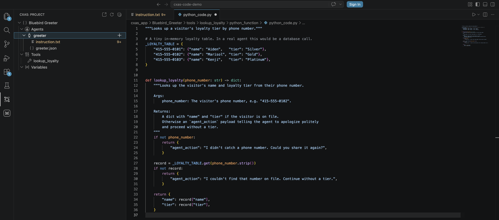

Save the file. The extension's tool-sync provider notices that the `greeter` agent's instruction now references `{@TOOL: lookup_loyalty}` and offers to add `lookup_loyalty` to the agent's `tools` array on the next save of `greeter.json`. Accept it, or run **`CXAS: Sync Callbacks`** later to bulk-fix.

---

## Step 6: Add a `before_agent` callback

Right-click the **`greeter`** agent node (not the `Agents` group). Pick **New Callback**:

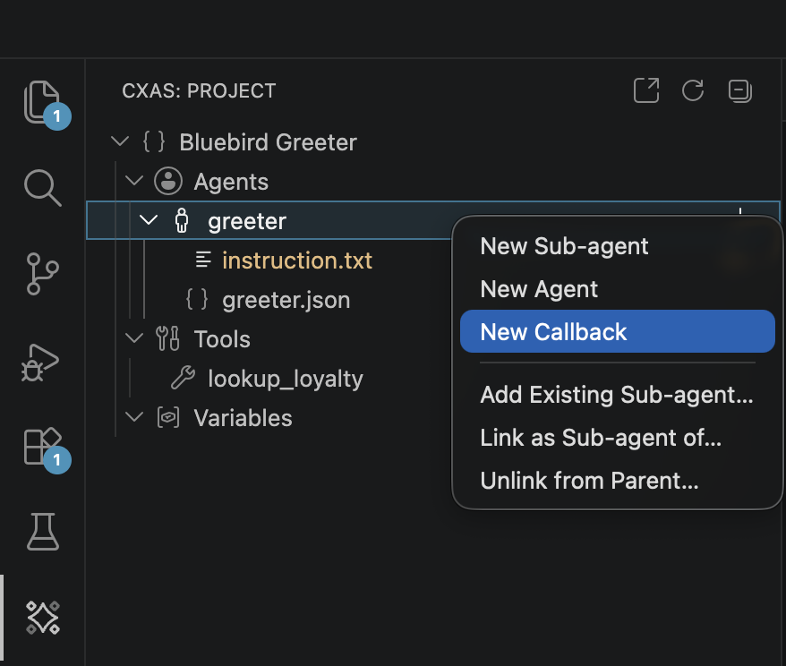

A QuickPick appears with the six callback types:

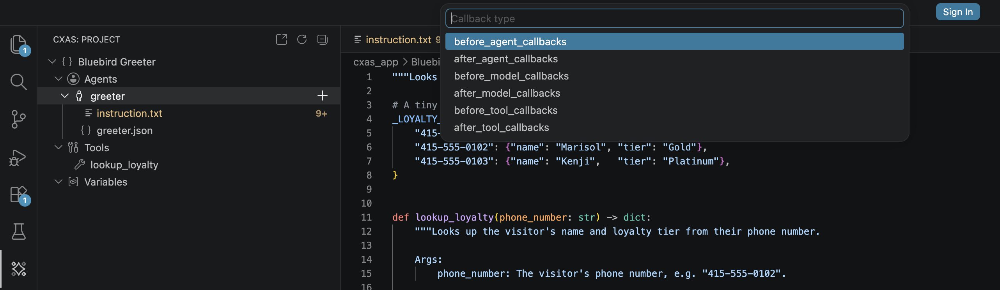

Pick **`before_agent_callbacks`**. When prompted for a name, enter `inject_today` and press **Enter**. The extension scaffolds `agents/greeter/before_agent_callbacks/inject_today/python_code.py` with a typed stub, then opens it.

Paste the implementation:

```python
# pyright: reportUndefinedVariable=false
# pylint: disable=undefined-variable,redefined-builtin,missing-function-docstring
# ruff: noqa: F821, A002
# CallbackContext, Content, Tool, LlmRequest, LlmResponse, Part are injected
# at runtime by the GECX sandbox -- do not import them.
"""Puts today's date into session state so the agent can reference it."""

from datetime import date


def before_agent_callback(callback_context: CallbackContext):
    """Fires once at the start of every turn. Sets `today` if it's missing."""
    if callback_context.state.get("today"):
        return None  # already set this session, leave it alone

    callback_context.state["today"] = date.today().isoformat()
    return None
```

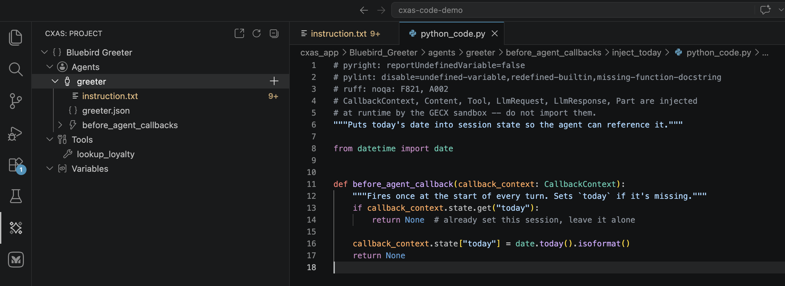

The header silences the lints that would otherwise complain about `CallbackContext` being undefined; that name is injected by the GECX runtime, not imported. See [Authoring features](authoring.md) for more on the callback scaffolding rules.

---

## Step 7: Hover and Cmd+click navigation

Switch back to `agents/greeter/instruction.txt`. Hover the mouse over `lookup_loyalty` inside any `{@TOOL: lookup_loyalty}` reference. After a moment, a tooltip appears with the tool's docstring, signature, and an example:

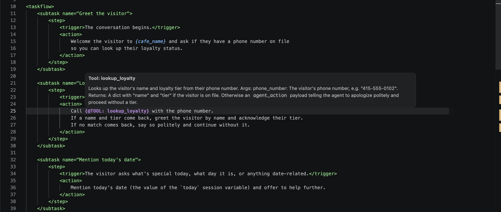

**Cmd+click** (or **F12 / Go to Definition**) on the same reference jumps directly to `tools/lookup_loyalty/python_function/python_code.py`. The same works for `{cafe_name}` (jumps to the variable in `app.json`) and any sub-agent reference inside `agents/<name>/<name>.json`.

---

## Step 8: Lint the project

The extension lints in the background as you type and surfaces issues in the Problems panel and as squiggles. To run the full project lint on demand, focus any project file and press **`Cmd+Shift+L`** (or run **`CXAS: Lint App`**):

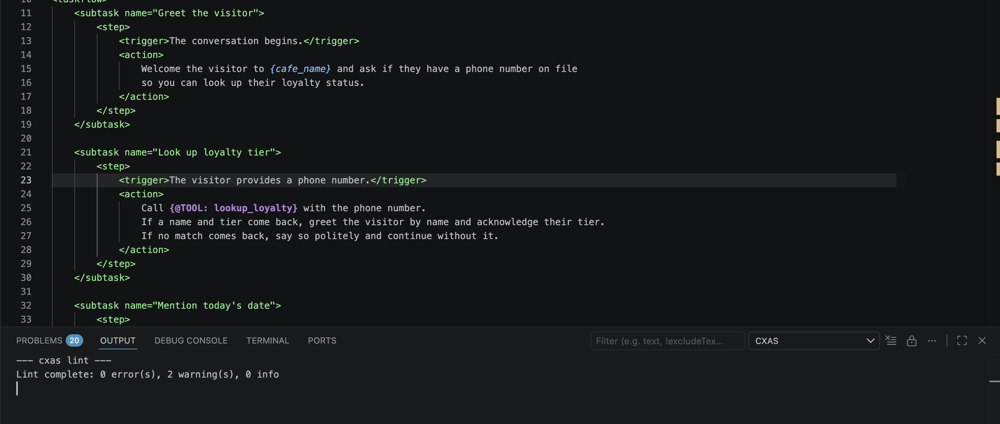

A clean run produces `0 error(s)` (warnings are advisory). If lint fails, fix the reported issues before pushing; the platform will reject some of the same problems anyway.

To preview what an inline lint failure looks like, temporarily add `Call {@TOOL: notarealtool} for fun.` inside any `<action>` block. Within a second, the editor squiggles `notarealtool` and the Problems panel shows the rule and a quick fix:

![instruction.txt showing the line 'Call {@TOOL: notarealtool} for fun.' with a red squiggly under 'notarealtool' and an inline tooltip 'I013] {@TOOL: notarealtool} referenced but not in agent's tools list cxas(I013)' offering 'Quick Fix... Add notarealtool to the tools array in the agent JSON'](../assets/vscode/inline-lint-squiggly.png)

Delete the bad line before continuing.

---

## Step 9: Push to CES

Run **`CXAS: Push App`**. The extension calls `cxas push --to projects/.../apps/<your-app-id>` with the resource name from `gecx-config.json`. The CXAS output channel streams the progress and prints the final resource name:

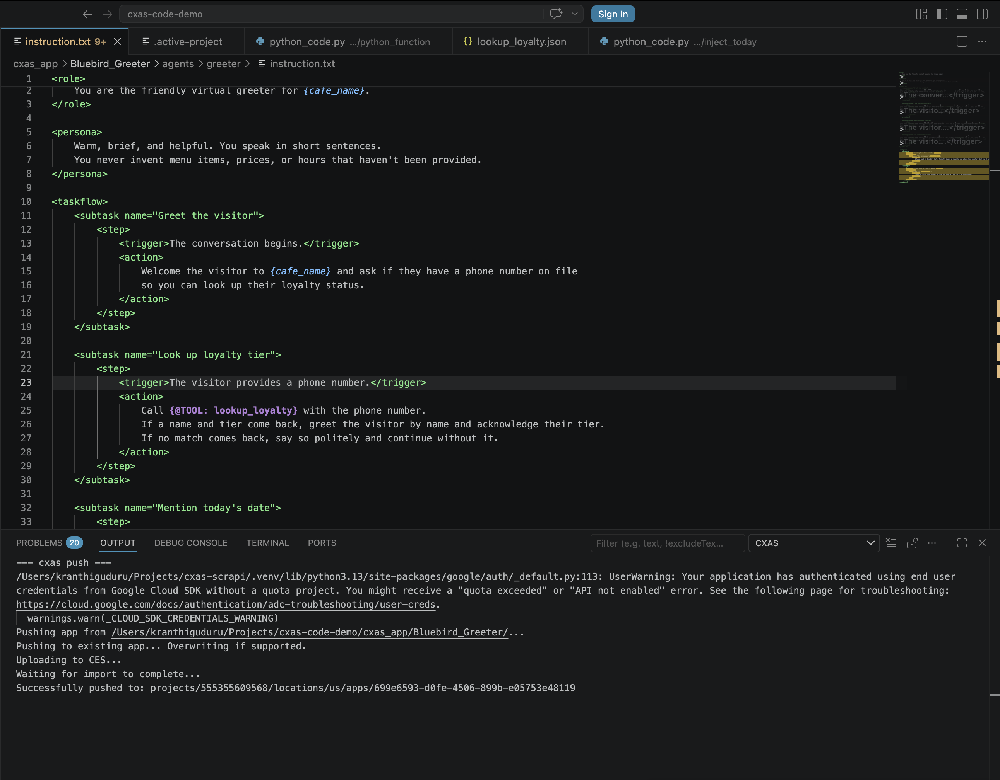

If the push fails, the status bar surfaces an error and the output channel has the full stack. Most failures are auth (`gcloud auth application-default login` and try again) or a stale `deployed_app_id` (delete the field from `gecx-config.json` and re-create the app).

---

## Step 10: Talk to the deployed agent

Run **`CXAS: Open Live Chat`**. A webview opens on the right. Type:

```
Hi, my number is 415-555-0102
```

Send it. The agent runs through the `before_agent` callback (which sets `today`), hits the `Look up loyalty tier` subtask, calls `lookup_loyalty`, and greets you by name. Send a second turn:

```
Thanks, that's all for today!
```

The agent thanks you back and calls `end_session`.


The expandable **Execution steps** panel under each agent turn shows the callbacks fired, model reasoning, and tools called. This is the fastest way to confirm a callback or tool actually ran rather than the agent making something up.

!!! tip "New Session vs continuing"
    Click **New Session** in the top right of the chat panel to clear state and start fresh. Without it, session variables (like the `today` your callback sets) persist between turns.

---

## Step 11: Add evals and run them

The plugin doesn't have a "New Eval" command; create the four YAML files directly under the workspace root (next to `gecx-config.json`, **not** inside `cxas_app/`).

`evals/tool_tests/lookup_loyalty.yaml`:

```yaml
tool_tests:
- tool: lookup_loyalty
  description: Verifies the loyalty lookup table is wired up correctly.
  test_cases:
  - name: known_gold_tier_visitor
    inputs:
      phone_number: "415-555-0102"
    expectations:
      name: "Marisol"
      tier: "Gold"

  - name: unknown_phone_number
    inputs:
      phone_number: "555-555-5555"
    expectations:
      agent_action: "I couldn't find that number on file. Continue without a tier."

  - name: missing_phone_number
    inputs:
      phone_number: ""
    expectations:
      agent_action: "I didn't catch a phone number. Could you share it again?"
```

`evals/callback_tests/inject_today.yaml`:

```yaml
callback_tests:
- callback: inject_today
  agent: greeter
  description: Verifies the callback puts a `today` key into session state.
  test_cases:
  - name: sets_today_when_missing
    initial_state: {}
    expectations:
      state_has_key: "today"

  - name: leaves_today_alone_when_already_set
    initial_state:
      today: "2026-01-01"
    expectations:
      state:
        today: "2026-01-01"
```

`evals/goldens/known_user.yaml`:

```yaml
conversations:
- conversation: gold_tier_visitor_says_goodbye
  tags: [p0, happy-path]
  session_parameters:
    cafe_name: "Bluebird Cafe"
  turns:
  - user: "Hi! My number is 415-555-0102."
    agent: "Welcome back to Bluebird Cafe, Marisol! Always a treat to see a Gold-tier regular. What can I get started for you?"
    tools:
    - name: lookup_loyalty
      args:
        phone_number: "415-555-0102"
  - user: "Just saying hi. I'll be in this afternoon."
    agent: "Lovely, see you then. Have a great rest of your day!"
    tools:
    - name: end_session
  expectations:
  - "The agent greets Marisol by name and acknowledges her Gold tier."
  - "The agent ends the session politely after the visitor says goodbye."
```

`evals/simulations/curious_visitor.yaml`:

```yaml
scenarios:
- scenario: curious_first_time_visitor
  tags: [p0, smoke]
  priority: P0
  max_turns: 6
  session_parameters:
    cafe_name: "Bluebird Cafe"
  task: |
    You are a first-time visitor walking into Bluebird Cafe.
    You do NOT have a phone number on file.
    Greet the agent, ask what day it is, and then politely say goodbye.
  expect_criteria:
  - "The agent welcomes the visitor and offers loyalty lookup."
  - "When the visitor declines or has no number, the agent continues without one."
  - "The agent mentions today's date when asked what day it is."
  - "The agent ends the session politely when the visitor says goodbye."
```

Refresh the CXAS tree (the refresh button on the panel header). The `Evals` group now lists all four YAMLs grouped by type. From here, see [Evaluations](evaluations.md) for the run/push/report workflow.

---

## What you have now

After 11 steps you've built:

- **An app** (`Bluebird Greeter`) with `bluebird_greeter` config wired into `gecx-config.json`
- **A root agent** (`greeter`) with a clean XML instruction
- **A tool** (`lookup_loyalty`) with three test cases
- **A callback** (`inject_today`) with two test cases
- **A golden** for the happy path and **a simulation** for the unknown-visitor flow
- A working **Live Chat** session against the deployed app

The same workflow scales to a multi-agent app: keep adding agents and sub-agents from the tree, keep tools and callbacks scoped under their parent agent, and keep evals at the workspace root so the runner can find them.

---

## Where to go next

[Authoring features](authoring.md)
:   The editor and tree features in detail: syntax highlighting rules, hover/Cmd+click semantics, snippet completion, scaffolding context menus.

[Evaluations](evaluations.md)
:   The full eval lifecycle: pushing platform goldens, running individual tests, the aggregated report panel.

[Importing from CES](importing.md)
:   The other way to start a workspace: pull a deployed app instead of building one from scratch.
