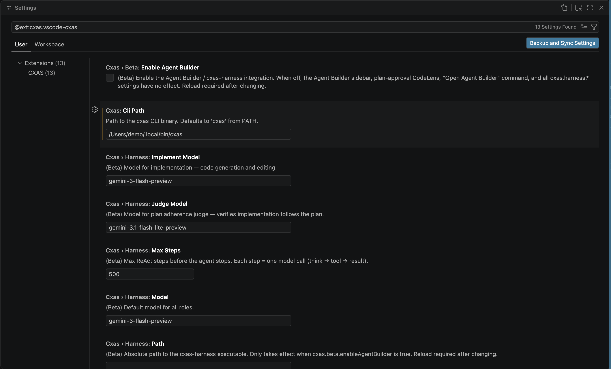

# Settings &amp; troubleshooting

This page is the reference for every `cxas.*` setting the extension exposes, plus the fixes for the most common breakage. For a more guided tour of the day-to-day features, start with [Authoring features](authoring.md).

---

## Settings reference

Open VS Code **Settings** (`Cmd+,`) and type `cxas` in the search bar to see all options:



| Setting | Default | Purpose |
|---|---|---|
| `cxas.cliPath` | `cxas` | Path to the `cxas` CLI binary. Set this if `cxas` isn't on your shell `PATH` (or the same `PATH` VS Code resolves), or if you maintain multiple installs (e.g. one in a project virtualenv). |
| `cxas.pythonPath` | _(empty — falls back to `python3`)_ | Override the Python interpreter the extension uses to invoke helper scripts. Useful when the system Python doesn't have `cxas-scrapi` installed but a project virtualenv does. |
| `cxas.lintOnSave` | `true` | Auto-run `cxas lint` whenever a project file is saved. Set to `false` if the on-save run is too noisy mid-edit; the inline lint and `Cmd+Shift+L` keybinding still work either way. |
| `cxas.scriptsPath` | _(empty — auto-detected from `.agents/skills/`)_ | Path to the bundled CXAS helper scripts directory. Leave blank unless you've moved the scripts somewhere non-standard. |
| `cxas.oauthToken` | _(empty)_ | OAuth token override for CES API authentication. Use this only when ADC isn't available; in normal development run `gcloud auth application-default login` instead. |

The keyboard shortcut **`Cmd+Shift+L`** (`Ctrl+Shift+L` on Linux/Windows) is bound to **`CXAS: Lint App`** while an editor has focus. Rebind it via VS Code's **Keyboard Shortcuts** UI (search `cxas.lint`).

---

## Common issues

**`cxas CLI not found` keeps showing after install.**
: Reload the window (`Developer: Reload Window`). If it still appears, the Python that has `cxas-scrapi` installed isn't the one VS Code resolved. Set `cxas.cliPath` to the absolute path of the `cxas` binary (use `which cxas` from a terminal where it works) and `cxas.pythonPath` to the matching interpreter.

**`pip install` fails with permission errors.**
: Install in user scope: `pip install --user cxas-scrapi`. If you're behind a corporate proxy or private package index, configure pip first and re-run the install command.

**Lint output is empty or wrong.**
: Run **`CXAS: Lint App`** from the Command Palette to see the raw output in the **CXAS** output channel. Confirm the active project (status bar, lower-left) points at the workspace you expect; the lint runs against that project, not against whichever file you happen to have open.

**Push or pull fails with `gcloud` auth errors.**
:
```sh
gcloud auth application-default login
gcloud config set project YOUR_PROJECT_ID
```
Then reload the window so the extension picks up the refreshed credentials.

**Tree view doesn't update after I add a file outside VS Code.**
: Click the refresh icon on the **CXAS Project** panel header. The extension watches files inside common directories (`agents/`, `tools/`, `evals/`, `app.json`), but a refresh forces a full re-scan.

**Inline lint shows different results than `cxas lint`.**
: The inline checker runs a fast TypeScript subset of the rules to keep typing responsive. The full Python linter (`cxas lint`) is authoritative; if the two disagree, trust the on-save / `Cmd+Shift+L` run.

**`Push App` fails with `404 Not Found`.**
: `gecx-config.json` has a stale `deployed_app_id`. Either delete the field and re-create the app with **`CXAS: Create App`**, or paste in the resource name of the app you actually want to push to.

**Live Chat shows `permission denied` or hangs after sending a message.**
: The deployed app may be in an error state, or your credentials lack `cxas.runConversation` permission. Open the app in the GCP console (right-click the app node → **Open in Console**) and confirm the latest deployment is healthy.

---

## Filing issues

When reporting a bug, include:

- The **CXAS** output channel contents (`View → Output → CXAS`)
- VS Code version (`Code → About`), OS, and `cxas --version` from a terminal
- Steps to reproduce, what you expected, what happened
- A minimal repro project if the bug is reproducible (the [Quickstart](quickstart.md) demo is a good base)

---

## Where to go next

[Overview](index.md)
:   Back to the section landing page.

[Quickstart](quickstart.md)
:   The end-to-end demo, useful for confirming a fresh install works.
